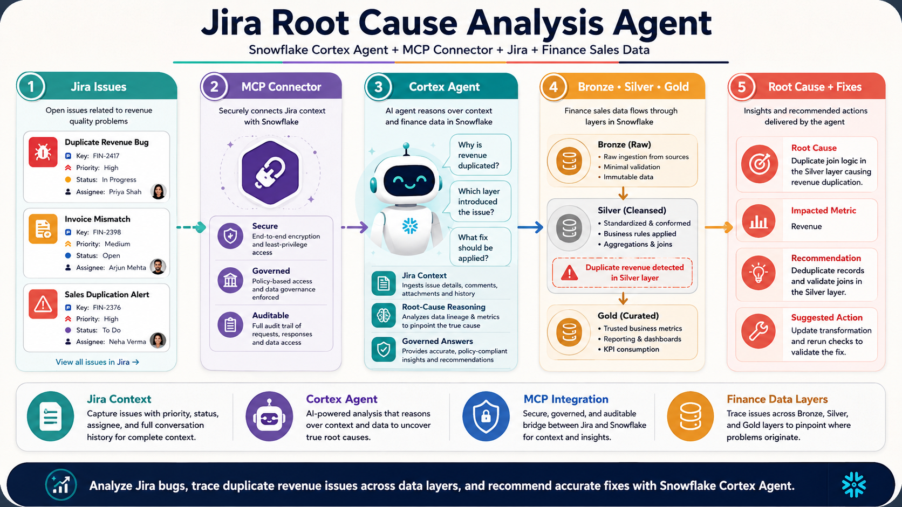

## Jira Bug Analysis using Snowflake MCP and Cortex Agent

An end-to-end Snowflake MCP project that connects Jira with a Cortex Agent for AI-powered bug analysis and root-cause investigation.

The solution analyzes finance sales data across Bronze, Silver, and Gold layers, uses a Snowflake Semantic View for business-friendly analytics, and connects Jira work items through MCP. The Cortex Agent investigates duplicate revenue issues, identifies the affected data layer, correlates findings with Jira bugs, and recommends accurate fixes.



### Use Case

Finance and data engineering teams may encounter issues such as duplicated transactions, overstated revenue, or inconsistent totals between data layers.

The Cortex Agent helps answer questions such as:

1. Why is total revenue higher than expected?
2. Which sales transactions are duplicated?
3. In which data layer was the duplicate introduced?
4. What is the difference between Bronze, Silver, and Gold revenue totals?
5. Are there Jira bugs related to the revenue issue?
6. What is the likely root cause?
7. What changes are required to fix the issue?

The agent combines Snowflake finance data with Jira work-item context to provide a complete bug investigation and remediation summary.

### Sample Jira Work Items

The project includes sample Jira work items for a financial analytics use case.

```text
JIRA_work_items/JIRA_Financial_Analytics_Project_Work_items_Import.csv
```

Import the file into a Jira project and update project keys, issue types, assignees, and field mappings based on your Jira environment.

### Architecture

```text
Finance Sales Data
      │
      ▼
Bronze Layer
      │
      ▼
Silver Layer
      │
      ▼
Gold Layer
      │
      ▼
Semantic View
      │
      ▼
Snowflake MCP Server
      │
      ├── Jira MCP Connection
      │        │
      │        ▼
      │   Jira Work Items
      │
      ▼
Cortex Agent
      │
      ▼
AI-powered Bug Analysis and Root-Cause Investigation
```

## Setup

### 1. Create Bronze Layer

Create the raw finance sales tables and load the source data.

```sql
00_setup/00_create_bronze_layer.sql
```

### 2. Create Silver Layer

Clean, standardize, and prepare the Bronze data for duplicate detection and downstream processing.

```sql
00_setup/01_create_silver_layer.sql
```

### 3. Create Gold Layer

Create analytics-ready finance and revenue models for reporting and reconciliation.

```sql
00_setup/02_create_gold_layer.sql
```

### 4. Import Jira Work Items

Import the sample work-item file into Jira.

```text
JIRA_work_items/JIRA_Financial_Analytics_Project_Work_items_Import.csv
```

### 5. Create Semantic View

Create a Semantic View that exposes business-friendly sales dimensions and revenue measures to the Cortex Agent.

```sql
01_mcp_and_agent/00_create_semantic_view.sql
```

### 6. Create Snowflake MCP Server

Create the MCP server that provides controlled access to the Snowflake analytical objects.

```sql
01_mcp_and_agent/01_create_mcp_server.sql
```

### 7. Create Jira MCP Connection

Configure the connection between Snowflake and Jira.

```sql
01_mcp_and_agent/02_create_jira_mcp_connection.sql
```

Update the Jira URL, authentication configuration, and required connection values before running the script. Do not commit passwords, API tokens, or other secrets to the repository.

### 8. Create Cortex Agent

Create the Cortex Agent that uses the Semantic View, Snowflake MCP Server, and Jira MCP connection.

```sql
01_mcp_and_agent/03_create_cortex_agent.sql
```

### 9. Configure Role-Based Access Control

Grant the required privileges to the roles that create, operate, and use the solution.

```sql
01_mcp_and_agent/04_RBAC.sql
```

### 10. Use the Cortex Agent

Open the Cortex Agent in Snowflake and ask questions such as:

```text
Why is finance revenue overstated?

Compare revenue totals across the Bronze, Silver, and Gold layers.

Identify duplicate sales transactions and explain where they were introduced.

Find Jira work items related to duplicate revenue issues.

Determine the root cause and recommend the required fix.

Summarize the impacted records, related Jira bugs, and validation steps.
```

## Agent Behaviour

The agent is designed to:

- Analyze finance sales data through the Snowflake Semantic View.
- Compare Bronze, Silver, and Gold layer results.
- Identify duplicate transaction IDs or repeated business keys.
- Determine the layer or transformation where the issue was introduced.
- Retrieve relevant Jira bugs and work-item details through MCP.
- Correlate Jira investigation notes with Snowflake data findings.
- Explain the likely root cause in clear business language.
- Recommend SQL, pipeline, or data-quality fixes.
- Provide validation steps to confirm that the issue is resolved.
- Avoid inventing Jira issues, data findings, or remediation details that are not available through the configured tools.

Example investigation question:

```text
Why is the Gold-layer revenue higher than expected?
```

Expected investigation flow:

```text
1. Compare revenue totals across Bronze, Silver, and Gold.
2. Identify duplicate transactions or repeated business keys.
3. Locate the transformation step where duplication occurred.
4. Retrieve related Jira bugs and investigation notes.
5. Explain the root cause.
6. Recommend a fix and provide validation queries.
```

## Snowflake Features Used

- Snowflake tables and views
- Bronze, Silver, and Gold data layers
- Snowflake Semantic Views
- Snowflake MCP Server
- External MCP connection for Jira
- Snowflake Cortex Agent
- Role-Based Access Control

## Repository Structure

```text
Jira_BUG_Analysis_MCP_to_Snowflake/
│
├── 00_setup/
│   ├── 00_create_bronze_layer.sql
│   ├── 01_create_silver_layer.sql
│   └── 02_create_gold_layer.sql
│
├── 01_mcp_and_agent/
│   ├── 00_create_semantic_view.sql
│   ├── 01_create_mcp_server.sql
│   ├── 02_create_jira_mcp_connection.sql
│   ├── 03_create_cortex_agent.sql
│   └── 04_RBAC.sql
│
├── JIRA_work_items/
│   └── JIRA_Financial_Analytics_Project_Work_items_Import.csv
│
├── cleanup/
│   └── cleanup.sql
│
└── README.md
```

## Cleanup

Run the cleanup script to remove the Snowflake objects created for this project.

```sql
cleanup/cleanup.sql
```

Review the script before execution and confirm that the selected database, schema, integrations, roles, and other objects are no longer required.

## Disclaimer

This project is created for demonstration purposes. The Cortex Agent provides analysis based only on the Snowflake data, Semantic View, MCP tools, and Jira work items available to it. Review all recommendations, SQL changes, access controls, and remediation steps before applying them in a production environment.
